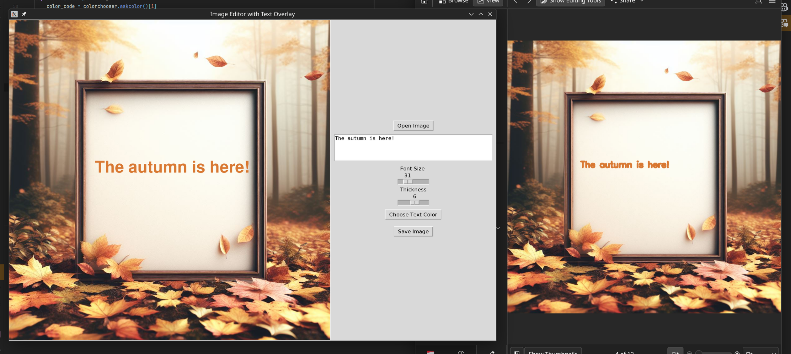

# Basic Canvas Editor

This project is a basic paint editor implemented using OpenCV and Tkinter in Python that allows users to set a background image for a canvas and drag and drop custom text on it. 
The user can specify the font size and thickness of the text using sliders and the color using a color picker. Afterwards, the user can save the edited image to a file using OpenCV.

## Output example

## GUI Usage

## Project Scaffolding

Poetry automatically configures a virtual environment for installing your Python packages. This environment can be activated by running `poetry shell` from within your poetry project.

For more information, see the [Poetry Docs](https://python-poetry.org/docs/basic-usage/)

### How to Run

In this directory, run:

`devbox shell`

This will automatically activate your poetry shell via the `init_hook`.

To exit the poetry shell, use `exit`. To exit your devbox shell, use `exit` again.

### Configuration

Since Poetry automatically configures a virtual environment for you, no additional Devbox configuration is needed. You can mange your packages and projects.
