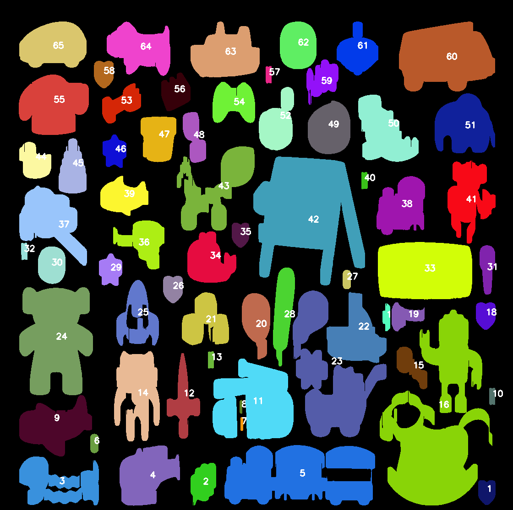

# Object Counter

## Technology Stack
- **Programming Language**: Python
- **Libraries**:
  - OpenCV
  - NumPy
  - Tkinter
  - PIL (Python Imaging Library)

## Features
- Load an image from the file system.
- Apply Gaussian blur and Canny edge detection to identify object contours.
- Dilate edges to connect separate components.
- Draw contours on the image and label them with unique numbers.
- Preserve colors for already identified object contours and add new ones if other contours are further identified.
- Save the processed image with identified contours.

## Examples

### Input Image

### Output Image

### Live Demo
